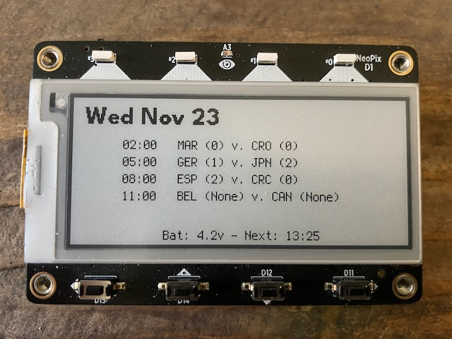
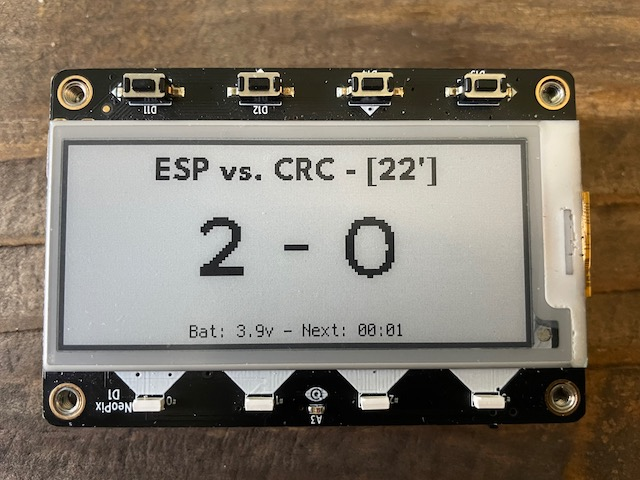

# MagTag - World Cup

Switch between Today's Schedule and Live Match score by rotating the MagTag.

This script uses the amazing [World Cup JSON](https://github.com/estiens/world_cup_json) to get its information. For now, the Live Match page only shows the current scores. In-game stats will be added when they become available on the JSON. Looks like it'll be [happening soon](https://github.com/estiens/world_cup_json/issues/210#issuecomment-1325489429).

# Usage

Once setup, select **Schedule** view or **Live Game** view by changing the orientation of the device. At the next update, the MagTag will check the orientation and display the selected view. For an immediate update simply click the reset button.

## Game Schedule View - Upside Up:

### Live Game View - Upside Down:

### Installation

1. Update board to use [CircuitPython 8.0.0-beta.4](https://circuitpython.org/board/adafruit_magtag_2.9_grayscale/) or higher.
2. Copy [required libraries](https://circuitpython.org/libraries) into `/lib` folder.
3. Copy repo files onto the MagTag.
4. Update `secrets.py` with your WiFi credentials.
5. Update `User Settings` block in `code.py`

## Requirements

* [CircuitPython 8.0.0-beta.4](https://circuitpython.org/board/adafruit_magtag_2.9_grayscale/) or higher.

### Libraries
Make sure these libraries are installed in the `/lib` folder of the MagTag. The easiest way to find them is by downloading the [Bundle for Version 8.x](https://circuitpython.org/libraries) from the CircuitPython page.

- adafruit_bitmap_font 
- adafruit_display_text 
- adafruit_display_shapes
- adafruit_datetime 
- adafruit_requests
- adafruit_io
- adafruit_lis3dh
- neopixel

## ToDo

- In-game stats when available.
- Display next game info on Live Match page when no game is being played.
- Favorite team details when turned vertically.
- Fine-tune refresh times so MagTag only updates at midnight, just before a match, and then at regular intervals during a match.
